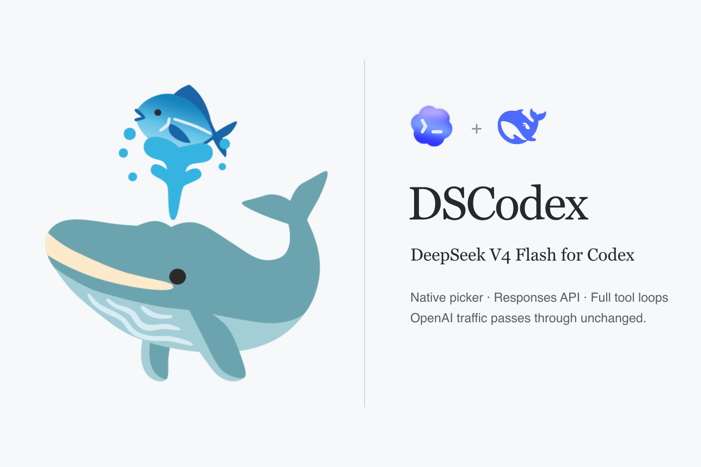

# DSCodex

<div align="center">



<p>
  <a href="https://github.com/fish2lab/DSCodex/releases/latest"></a>
  <a href="https://github.com/fish2lab/DSCodex/stargazers"></a>
  <a href="https://developers.openai.com/codex/"></a>
  <a href="https://api-docs.deepseek.com/zh-cn/guides/responses_api/"></a>
  <br />
  <a href="https://api-docs.deepseek.com/zh-cn/guides/responses_api/"></a>
  <a href="package.json"></a>
  <a href="#环境要求"></a>
  <a href="LICENSE"></a>
</p>

<p><strong>DeepSeek V4 Flash for the stock ChatGPT desktop app, Codex CLI and IDE — native Responses API, full agentic tool loops, no fork.</strong></p>
<p>在原版 ChatGPT 桌面端与 Codex 中使用 DeepSeek V4 Flash，同时保留 GPT OAuth 模型。</p>

</div>

简体中文 · [English](README.en.md)

## 它解决什么问题

DSCodex 是一个约 40 KB、零依赖的 Node 本地路由，把 DeepSeek V4 Flash 加进原版 ChatGPT 桌面端 / Codex 的原生模型菜单——不改 App、不 fork Codex，GPT 模型照常走你的 OAuth 订阅。菜单里增加一项（桌面端、CLI、IDE 三端共用）：

```text
🐳 V4 Flash   ·   默认 Max   ·   可选 High / Max
```

- **原生环境用不了 DeepSeek。** Codex 的所有请求只走全局 `openai_base_url`，指到 DeepSeek 就废掉 GPT 模型；Chat Completions 式的转换接入又会丢工具循环。DSCodex 按模型名分流：V4 Flash 走 DeepSeek **原生 Responses API**（SSE），其余请求原样转发给 ChatGPT 后端。shell、`apply_patch`、function call、web search 全套工具照常可用。
- **切模型互相覆盖思考档位。** 桌面端切模型会把当前 effort 写进全局配置，OpenAI High 和 DeepSeek Max 互相覆盖。DSCodex 为两个 provider 各维护一个独立槽位——切回 GPT 时自动恢复它原来的档位和速度；已跟踪线程、重启后恢复的线程与新开会话行为一致。
- **V4 Flash 是纯文本模型看不了图。** 目录为它声明 image 模态后，桌面端的贴图与 `view_image` 结果会随请求发出；路由把其中的图片并发交给 GPT（借用你的 OAuth，无需额外 key）生成文字描述，再以纯文本注入 DeepSeek 上下文。同一张图按 sha256 缓存，只描述一次。

## 工作原理

```text
Codex App / CLI / IDE
        │  HTTP/SSE（zstd 压缩请求、OAuth 头）
        ▼
http://127.0.0.1:10110/<router-token>/v1   ← 带认证的 DSCodex 本地路由
        │
        ├── model == "deepseek/deepseek-v4-flash"
        │        ▼   （请求里的图片先经 chatgpt.com 做 GPT 识图，
        │              文本描述注入后再转发）
        │   https://api.deepseek.com/responses   （DeepSeek 原生 SSE）
        │
        └── 其他任何模型（gpt-5.6-*、codex-auto-review 等）
                 ▼
        https://chatgpt.com/backend-api/codex    （OAuth 流量原样转发）
```

`openai_base_url` 指向本地路由，`model_catalog_json` 把 V4 Flash 合入模型目录；路由只改写该模型的 provider 字段，其余请求原样转发。桌面端经 `CODEX_CLI_PATH` 挂一个透明 bridge，只改写模型选择的 JSONL RPC，再交给 App 自带的原版 Codex 二进制；双槽 effort/speed 状态就存在这个 bridge 里（`~/.codex/dscodex/model-selections.json`）。

## 环境要求

- macOS、Linux 或 Windows（原生，无需 WSL），Node.js 24.5+（推荐 26，自带 zstd；代理模式依赖 24.5+ 的 `--use-env-proxy`）
- 已登录的 ChatGPT 桌面端或 Codex CLI（GPT OAuth 模型需要）
- DeepSeek API Key（`sk-…`）
- 端口 `10110` 空闲（`--port` 或 `DSCODEX_PORT` 可改）

## 安装

### 交给 Coding Agent 安装（推荐）

仓库按“克隆下来直接让 Agent 装”设计。把本 README 交给 Agent（或克隆仓库让它读 `AGENTS.md`）：

1. 拿到 DeepSeek API Key，**不要打印、不要提交进仓库**；存入本地配置：`DEEPSEEK_API_KEY=sk-… node src/cli.mjs key set`（或交互隐藏输入），落在 `~/.codex/dscodex/config.json`（权限 0600；Windows 使用 DPAPI 加密），重启/注销后仍有效。
2. `node src/cli.mjs install` —— 写入两条带标记的根配置，把 `🐳 V4 Flash` 合入模型目录；遇到用户自有的 `openai_base_url` 拒绝覆盖。
3. `node src/cli.mjs start`，再 `node src/cli.mjs doctor` —— 六项检查（含路由令牌和 app-server bridge）必须全部 `ok`。
4. `npm test` —— 全部测试通过。
5. 让用户完全退出（`⌘Q`）并重开 ChatGPT 桌面端，新建任务后选择 `🐳 V4 Flash`。
6. 验证真实工具循环：`codex -m deepseek/deepseek-v4-flash -c 'model_reasoning_effort="max"' -a never exec --skip-git-repo-check 'call a shell tool once …'` —— 模型必须发起工具调用、读取输出并正常结束。

### 手动安装

```bash
cd /path/to/DSCodex
node src/cli.mjs key set   # 隐藏输入,存入 ~/.codex/dscodex/config.json (0600)
node src/cli.mjs proxy set http://127.0.0.1:10808   # 可选:chatgpt.com 需要代理时（如大陆网络）
node src/cli.mjs install
node src/cli.mjs start
node src/cli.mjs doctor
node src/cli.mjs autostart enable   # 可选:登录自启路由 (launchd / systemd / 任务计划)
```

然后退出重开 ChatGPT 桌面端，新建任务，选择 `🐳 V4 Flash`。

Windows（PowerShell）命令相同；用环境变量方式存 key 时写成 `$env:DEEPSEEK_API_KEY="sk-…"; node src/cli.mjs key set`。

命令：`install`、`sync`、`key set|status|delete`、`proxy set|status|clear`、`start`、`serve`、`autostart enable|disable|status`、`status`、`doctor`、`stop`、`uninstall`。

CLI 注意：`-m deepseek/deepseek-v4-flash` 不带覆盖参数时可能显示 `High`；需要 Max 时加 `-c 'model_reasoning_effort="max"'`。

## 已验证行为

- 真实 DeepSeek 工具循环与 GPT OAuth 旁路均端到端实测通过（`DSCODEX_TOOL_OK`、`DSCODEX_GPT_OAUTH_OK`）。
- bridge 覆盖默认 picker、已有任务切换、Fast 恢复与重启后的状态持久化；`model/list` 返回 `🐳 V4 Flash`、默认 `max`、可选 `["high","max"]`，原生 GPT 条目保留。

## 兼容性速查

| 场景 | 状态 |
| --- | --- |
| ChatGPT macOS 桌面端原生模型菜单 | 支持 |
| Codex CLI / IDE 扩展 | 支持 |
| Windows 原生（Codex CLI / IDE 扩展） | 支持；app-server bridge 为 macOS 专属，见下文 |
| DeepSeek 多轮工具调用 | 支持，走原生 Responses API |
| GPT / Codex OAuth 模型 | 支持，流量原样旁路 |
| chatgpt.com 网页版 | 不支持；DSCodex 接入的是本地 Codex 运行时 |

## 已知行为与边界

- **用量统计。** Codex App「Profile」的用量统计是只读的，无法计入 DeepSeek 用量——已实测。
- **GPT 识图。** 识图借用请求自带的 ChatGPT OAuth 头，描述质量取决于 GPT 模型（默认 `gpt-5.6-sol`，`DSCODEX_VISION_MODEL` 可换）。无 OAuth 头（纯 API key 场景）时图片原样透传；识图失败时注入明确占位文本，DeepSeek 会如实说看不到。描述缓存在路由进程内存中，重启失效；app-server 若重新编码图片，data URL 变化会导致重新描述。
- **代理。** 路由器必须能访问 chatgpt.com：Node 的 fetch 默认忽略系统/环境代理，因此 DSCodex 会自行解析代理（`DSCODEX_HTTPS_PROXY` / `DSCODEX_HTTP_PROXY` → 按 Node 规则优先小写的标准代理变量 → `proxy set` 存储值），并以 `--use-env-proxy` 重启自身（Node ≥24.5）。GPT 转发与 GPT 识图同链路生效；`NO_PROXY` 默认含回环地址和 `api.deepseek.com`，DeepSeek 保持直连。大小写代理变量会同步设置，带用户名/密码的代理 URL 会在 CLI 输出中脱敏，Windows 上用 DPAPI 加密保存。
- **WebSocket 警告。** 目录声明 `prefer_websockets = false`，路由对探测回 `426`，Codex 回退 HTTP/SSE；`codex doctor` 可能仍显示警告，但请求正常。
- **Voice、Pets、插件、技能、MCP。** 都是客户端功能；语音由 GPT-Live 驱动，不会路由到 DeepSeek。
- **Key 存储。** 保存在 `~/.codex/dscodex/config.json`（权限 0600，目录 0700）；Windows 使用当前用户 DPAPI 加密，POSIX 系统依靠仅所有者可读的文件权限。旧版 Windows 明文 key 会在下一次安装、启动或配置写入时自动迁移。介意持久化的话不要 `key set`，改用每次会话的 `DEEPSEEK_API_KEY`（或 macOS `launchctl setenv`）。运行时取值顺序：环境变量 → 存储文件 → macOS 登录会话；`key delete` 并重启路由即彻底清除。
- **本地边界。** `install` 会生成 256 位路由令牌并写入 `openai_base_url`；`start` / `serve` 会校准 CLI 自有的 URL、端口和令牌，`doctor` 会验证三者一致，不带令牌的请求返回 404。`stop` 使用同一令牌和一次性关闭令牌握手，并以实例身份原子认领 PID 状态，不会删除替代实例的状态或向未经验证的 PID 发信号；请求体和解压后请求体均有限制，避免本地进程因异常输入发生内存峰值。
- **平台差异。** 路由、key 存储、目录合并全平台一致；app-server bridge（桌面端模型菜单的状态记忆）仅 macOS——Windows 桌面端直接 spawn `CODEX_CLI_PATH`，脚本 shim 起不来（CreateProcess 只认 `.exe`），因此 Windows 上 `install` 跳过 bridge、`doctor` 对应项自动 `ok`。Windows 的配置目录同样是 `%USERPROFILE%\.codex`；key 文件的 0600 权限位在 Windows 不生效，依赖账户 ACL 保护。路由默认不随机启动；`node src/cli.mjs autostart enable` 可注册登录自启（macOS launchd / Linux systemd user service / Windows 任务计划），崩溃会被自动拉起，而手动 `stop` 是优雅退出（退出码 0），不会被复活；`autostart disable` 和 `uninstall` 都会移除自启项。未开启自启时，重启后重新 `node src/cli.mjs start` 即可（key 已持久化，无需重配）。

## 任务中思考为什么反复折叠

DeepSeek 的 Responses 流在**每轮工具调用结束**时发 `response.reasoning_text.done` / `response.output_item.done` / `response.completed`，Codex 收到就折叠思考块、执行工具，再开新请求让下一轮思考重新展开——这是 API 行为，不是 bug。DSCodex 逐字节透传；抑制 `response.completed` 会让工具循环卡死。无工具的单轮只折叠一次。

## 卸载

```bash
node src/cli.mjs stop
node src/cli.mjs uninstall
```

只删除 DSCodex 写入的配置行、合并后的模型目录、双槽状态和它设置的 `CODEX_CLI_PATH`；备份留在 `~/.codex/config.toml.pre-dscodex.bak`，GUI 写入的配置不动。

## 参考

- [DeepSeek Responses API](https://api-docs.deepseek.com/zh-cn/guides/responses_api/)
- [DeepSeek Codex 接入](https://api-docs.deepseek.com/zh-cn/quick_start/agent_integrations/codex/)
- [OpenAI Codex manual](https://developers.openai.com/codex/codex-manual.md)

## 许可证

[MIT](LICENSE)
